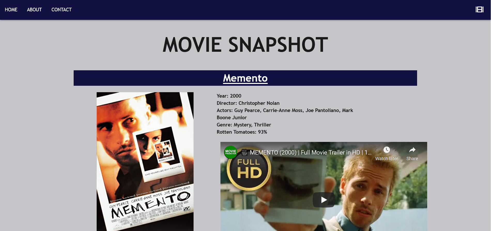
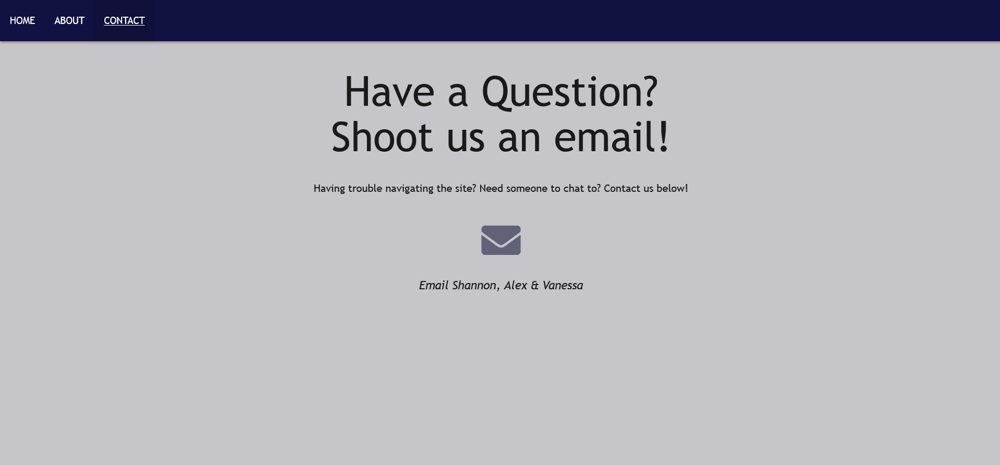

# Movie_Snapshot
Project 1 - Group Apples
# Description
 This website helpsclear search up movies and provide highlighted details such as 
    -Rotten tomatoes 
    -YouTube Trailer
    -Details such as director, year, and actor information

# How to Use
-Website allows user to search popular movie titles, the result page will then bring up the name of the movie in the heading.
-Once movie has been search it shows a synopsis, movie poster and Trailer.
-Synopsis includes information such as Year is came out, Director, Actors, Genre and Rotten Tomatoes score
-User can interact with website by playing the trailer associated with the movie.
-We also included an About page to let user know a bit more about the creaters of the Website, including a breif bio.
-A contact page is also included in case user has any questions or trouble. 
-This allows user to email us directly throught their email.

# Technologies used/ APIS
* [https://developers.google.com/youtube/v3/docs/playlists/list]
* [https://www.omdbapi.com/]

# Credit 
Alex Chisar, Shannon Alexander, and Vanesa Gonzalez

# Github link 
[https://github.com/sa605935/Movie_Snapshot]
# URL
[sa605935.github.io/movie_snapshot/]

# Tutorials/ Resources
[https://www.youtube.com/watch?v=TE66McLMMEw&t=302s&ab_channel=AnsontheDeveloper]

# Mock up & Screen shots
* [https://drive.google.com/file/d/1hMtULu7plaZH1u9pdfDBFmwx6x1xy76E/view]

